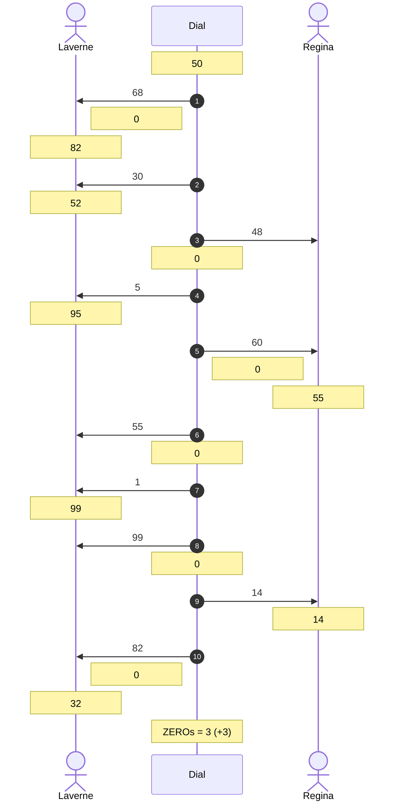

```mermaid
sequenceDiagram
autonumber

    actor A as Laverne
    participant Dial
    actor B as Regina
    note over Dial: 50

    Dial->>A: 68
    note left of Dial: 0
    note over A: 82

    Dial->>A: 30
    note over A: 52

    Dial->>B: 48
    note over Dial: 0
    %% note over A,B: 0

    Dial->>A: 5
    note over A: 95

    Dial->>B: 60
    note right of Dial: 0
    note over B: 55

    Dial->>A: 55
    note over Dial: 0
    %% note over A,B: 0

    Dial->>A: 1
    note over A: 99

    Dial->>A: 99
    note over Dial: 0
    %% note over A,B: 0

    Dial->>B: 14
    note over B: 14

    Dial->>A: 82
    note left of Dial: 0
    note over A: 32

    note over Dial: ZEROs = 3 (+3)

    %% TODO: https://docs.mermaidchart.com/mermaid-oss/syntax/sequenceDiagram.html#loops
```